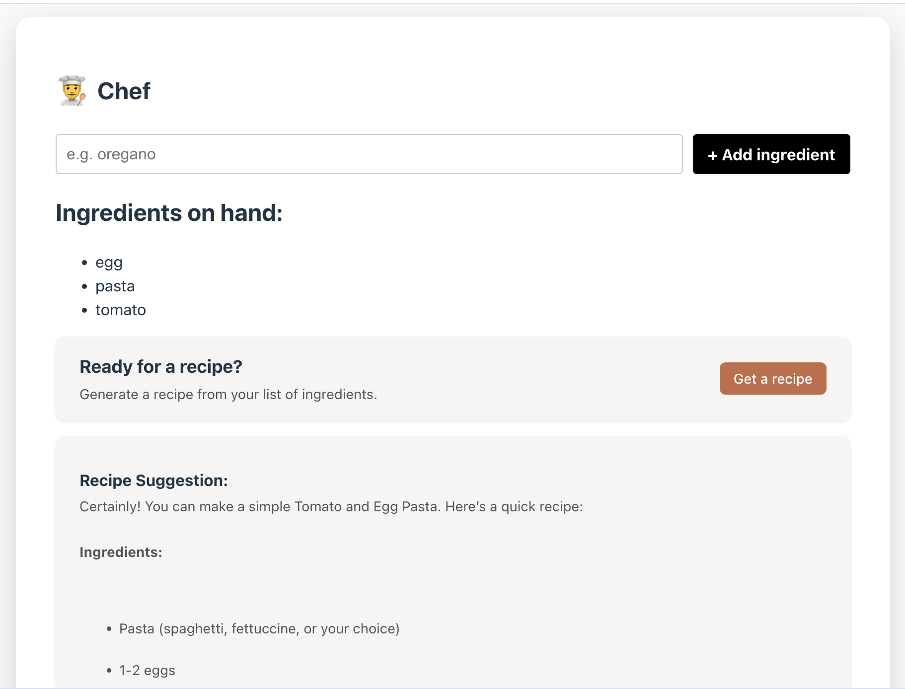

# 🧠 GPT-4o Recipe Generator 🍳

A React web app that generates a recipe using **OpenAI GPT-4o**, based on a list of ingredients you provide.



---

## 🔍 Features

- ✅ Add ingredients interactively
- ✅ Generate a complete recipe using GPT-4o
- ✅ Live loading state & smooth UI
- ✅ Component-based structure with React Hooks

---

## 🚀 Technologies Used

- React (Vite)
- OpenAI API (GPT-4o)
- CSS Modules / Custom styles

---

## 🧪 How to Run

1. Install dependencies:
   ```bash
   npm install
2. Create a .env file and add your OpenAI API key:
   ```bash
   VITE_API_HOST=openai
   VITE_API_DOMAIN=default
   VITE_OPENAI_API_KEY=sk-xxxxxxxxxxxxxxxxxxxxxxxxs
3. Start the app:
    ```bash
    npm run dev 